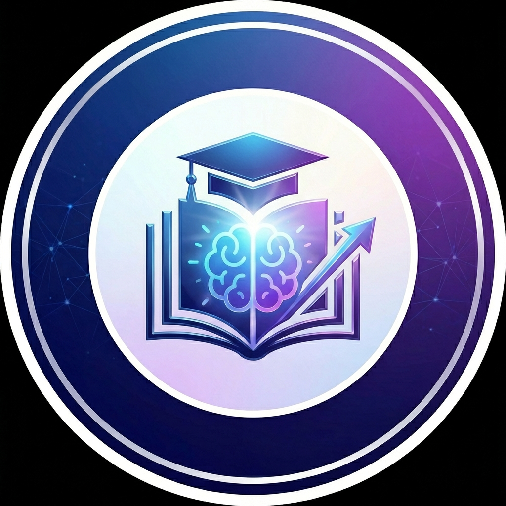

# 🇿🇦 MzansiEd
### Your AI CAPS Study Companion
**Empowering the next generation of South African leaders.**

[Visit the Platform](https://mzansied.co.za) | [Report a Bug](https://github.com/mahlatseclayton/TutorAI/issues)

---

## Project Overview

**MzansiEd** is a cutting-edge, AI-powered educational platform designed specifically for South African students following the **CAPS curriculum**. Built by passionate Computer Science students, MzansiEd aims to democratize access to high-quality tutoring and help learners excel in every subject with confidence.

## Core Features

| Feature | Description |
| :--- | :--- |
| **AI Learning Hub** | Get deep concept explanations, key formulas, and worked examples for any CAPS topic instantly. |
| **Intelligent Scan & Solve** | Snap a photo of any problem for step-by-step guidance. Features **built-in ML Computer Vision** for instant blur/lighting detection and optimized image compression. |
| **Past Paper Vault** | Access a massive database of IEB and DBE past papers with integrated AI assistance. |
| **Strict Quizzes** | Test your knowledge with rigorous, time-pressured quizzes that give you real-time score tracking. |
| **Curated Lessons** | Watch hand-picked educational videos that align perfectly with the concept you're studying. |

## Mission

Our mission is to bridge the educational gap in South Africa. By combining elite-level AI logic with the specific needs of the local curriculum, we provide every student with a personal, intelligent tutor available 24/7.

## Development Team

- **Mahlatse Maredi** — Founder & Developer
- **Junior Sebetola** — Co-Founder & Developer

## Tech Stack

- **Frontend**: HTML5, Vanilla CSS3 (Premium Glassmorphism UI), JavaScript (ES6+)
- **Client-Side ML**: Custom Computer Vision (Laplacian variance & Luma tracking for real-time image quality detection)
- **Backend**: Firebase (Hosting, Functions, Firestore, Auth)
- **AI Engine**: Google Gemini API
- **Deployment**: Firebase Hosting & GitHub Actions (CI/CD)

## ⚖️ Strict License

**© 2026 MzansiEd. All Rights Reserved.**

This software is **proprietary**. Unauthorized copying, modification, or distribution is strictly prohibited. See the [LICENSE](LICENSE) file for the full proprietary terms.

---

  *Developed with heart by students for students.*

